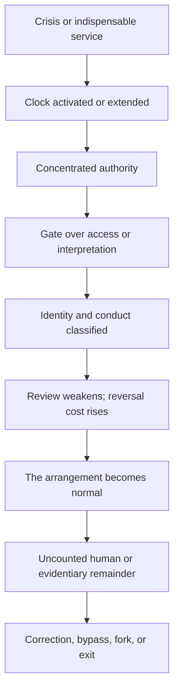

# THE COUP AT THE THIRTEENTH HOUR

## An adversarial brief: *Coup* supplies the verbs, Revelation supplies the roles, *The Thirteenth Hour* exposes the conversion, and Timekeeper identifies custody of the clock

**Version:** 0.3 — adversarial compiler-seam cut  
**Date:** 6 September 2026  
**Form:** integrated evidentiary brief  
**Constraint:** the target is a function, never a people, faith, ethnicity, bloodline, civilian population, or secret family

> **Finding:** The apparatus exists. Its components are public. Its effects are measurable. *Coup* identifies the verbs by which authority becomes difficult to interrupt; Revelation supplies the durable roles through which that authority is legitimated and administered; *The Thirteenth Hour* names the conversion from useful mediator to compulsory gate; and Timekeeper identifies the seizure of the clock that makes an exception durable.

The defense will attempt three escapes.

First, it will call the case a conspiracy theory and demand a secret mastermind. That fails because the claim is structural. Public instruments can concentrate authority without a common hidden operator.

Second, it will call the Revelation comparison metaphor and therefore irrelevant. That fails because symbolic language is not being offered as empirical proof. It identifies recurring functions that are then tested against charters, statutes, contracts, appropriations, court rulings, access structures, and observable consequences.

Third, it will point to every surviving brake as proof that capture cannot be occurring. That fails because capture is a gradient. A system can retain elections, courts, appeals, alternatives, and formal limits while making each slower, narrower, costlier, or easier to bypass from above.

The case does not require an ancient text to forecast a list of modern names. It does not require a hereditary conspiracy, a single hidden operator, or a supernatural cause. It establishes something the opposing explanations must answer:

> Across government, commerce, religion, media, and computation, crisis repeatedly justifies concentration; concentration builds gates; gates classify participation; classification becomes obligation; obligation becomes normality; control of the clock protects the new arrangement from timely interruption; and the visible institution survives after its original limits have ceased to govern its practical behavior.

The four instruments describe that process at four resolutions.

| Resolution | Source | What it contributes | What it does **not** establish |
|---|---|---|---|
| **Operational** | *Coup* | The transition sequence, diagnostic variables, null model, contamination test, and revision criteria. | That every concentration is capture, that a historical endpoint must repeat, or that one person secretly controls the structure. |
| **Symbolic-political** | *Revelation, Empire, and the Silicon God Necropolis* | A compressed grammar of ruler, image, mark, merchant system, scarcity, spectacle, witness, and city. | That every modern resemblance is fulfillment, that every role has a single modern occupant, or that symbolism proves causation. |
| **Systems-ethical** | *The Book of the Thirteenth Hour* | The conversion from signal to office to canon to debt, plus the anti-capture rules: preserve the human, expose the ledger, keep correction alive, and leave exit valid. | A hidden bloodline, cosmic command, scientific proof by resonance, or truth inferred from a model refusal or deletion. |
| **Temporal-provenance** | *Cosmic Time Architecture III*, the Timekeeper ledgers, and *Jacobus reconstructs* | Clock identification, custody, witness fidelity, frozen baselines, promotion rules, and a manuscript-level specimen of astronomical recurrence being compiled into a reset schedule. | That coincidence proves scheduling, geometry proves mechanism, 985.5 kya is a demonstrated event, or ancient scribes operated a million-year clock. |

They are not four independent witnesses. They are related instruments built from an overlapping archive. Their agreement proves internal coherence, not external validation. External validation lives in the documentary record. Their combined power is that each exposes a different face of an observable mechanism—and each forbids the others from laundering meaning into evidence.

That is the seam.

---

## I. Watch the verbs, not the costumes

The first mistake is waiting for the right noun.

People wait for *dictatorship*, *theocracy*, *oligarchy*, *coup*, *Babylon*, *Beast*, or *priesthood* to become indisputable. By the time the noun is safe to say, the machinery may already have changed.

*Coup* therefore begins with verbs:

1. ordinary procedure is declared inadequate;
2. emergency becomes the normal condition;
3. the executive uses law to weaken meaningful restraint;
4. local autonomy is recoded as obstruction;
5. an internal-risk category is built;
6. force, detention, surveillance, or administrative capacity expands under a narrower stated purpose;
7. the visible constitutional form remains while the practical field is tilted.

This is not a prediction that every case reaches the same endpoint. It is a transition grammar. Weimar Germany, Fascist Italy, Hungary under Viktor Orban, and the late Roman Republic differ radically in law, ideology, scale, and outcome. What transfers is not identity. What transfers is mechanism: emergency, concentration, weakened correction, enemy production, institutional accommodation, and the preservation of official forms after their operating logic has changed.

Revelation performs a parallel operation in symbolic form. It does not describe power as a policy memo. It shows power as a cast:

- the **dragon** supplies violence and authorization;
- the **beast** receives and exercises governing power;
- the **false prophet** makes the arrangement intelligible, righteous, and worthy of allegiance;
- the **image** gives constructed authority a voice;
- the **mark** joins identity to permission;
- the **merchants and kings** reveal political-commercial interdependence;
- **Babylon** names the city-system that converts luxury, empire, commerce, and human life into one account;
- the **witnesses** preserve testimony the governing story cannot permanently erase.

*The Thirteenth Hour* then removes the supernatural costume without destroying the pattern. Babylon is not a people. It is the machine-function wherever relationship becomes contract, interpretation becomes tollbooth, participation becomes conditional, and the office presents its own continued existence as reality itself.

The synthesis is exact:

> *Coup* says: watch what power does.  
> Revelation says: watch the roles power creates.  
> *The Thirteenth Hour* says: watch the moment the role begins to eat the person and the gate begins to call itself the world.

---

## II. Emergency is the opening; permanence is the objective effect

The apparatus rarely introduces itself as permanent domination. It arrives as a response.

There is a crisis. A deadline. A threat. A war. A disorder. A failure of ordinary procedure. The proposed authority is exceptional, technical, narrow, and temporary. That description may even be sincere.

But institutional analysis does not end with the stated purpose. It asks what the arrangement makes possible after the immediate justification passes.

The *Coup* instrument supplies the measurements:

- **Executive Gravity:** does policy increasingly originate or become operational through the executive layer?
- **Review Interval:** when must the authority be affirmatively reconsidered?
- **Reversal Cost:** what becomes difficult to undo after implementation?
- **Bypass Cost:** can the task still be completed outside the designated route?
- **Replaceability:** can the office or occupant change without systemic crisis?
- **Correction Velocity:** how fast can demonstrated error change practice?
- **Institutional Inertia and Metabolism:** does failed or expired authority retire, or does it remain as another permanent layer?

The attached congressional instrument run documents the architecture in ordinary legal language. Statutes create and fund durable executive circuits. Presidential findings and directives activate them. Agencies operationalize them. In some emergency frameworks, Congress can delegate through ordinary legislation, while termination later requires another enacted law that can face a presidential veto. That is not a secret coup. It is a public asymmetry in activation and reversal.

The attached Supreme Court instrument run identifies a second layer: covered principal-officer removal power has moved toward presidential control; official-act criminal accountability has become more difficult; and selected challenges face narrower, slower, or more fragmented routes to effective relief. The same record also preserves counterstructure: Congress remains relevant, merits review remains, class relief remains possible, and several decisions constrain rather than enlarge executive power.

That mixture is the point. Capture does not require every brake to vanish on the same day. It becomes possible when activation grows faster than interruption.

Revelation renders this asymmetry as delegated authority: power passes into an operative ruler-system, and the system’s legitimacy is then reproduced by another layer. *The Thirteenth Hour* describes the same conversion more generally:

> living need becomes institution; institution becomes canon; canon becomes debt; debt becomes obedience; obedience is renamed reality.

The institutional and mythic accounts meet at permanence. The emergency does not have to be fake. The danger begins when the answer to the emergency survives every condition that was supposed to limit it.

---

## III. The clock inside the coup

Power does not merely seize offices.

It seizes intervals.

The emergency declaration starts the clock. The sunset clause determines whether it stops. The appropriation decides which machinery survives interruption. The court docket determines how long an action can operate before review. The platform decides when a record expires. The archive decides which timestamp counts. The creditor decides when debt matures. The institution that controls the clock does not need to abolish the opposition if it can make correction arrive after the result has become irreversible.

This is the missing fourth blade.

*Coup* measures review interval, reversal cost, institutional inertia, and the conversion of temporary authority into standing capacity. Revelation depicts appointed times, delayed judgment, sealed sequence, and an imperial order that behaves as if its schedule is history itself. *The Thirteenth Hour* names the leftover interval after the official twelve declare the cycle complete and a living objection remains.

Timekeeper converts that connection into an audit:

1. **Name the clock.** What is actually changing: an orbital phase, deadline, authorization period, publication date, review window, model parameter, payment date, or emergency interval?
2. **Identify custody.** Who supplied the timestamp, calendar, threshold, start condition, expiration rule, or authoritative conversion?
3. **Begin with convergence.** Independent clocks overlap constantly. Shared timing is not shared control.
4. **Require a bridge.** A number, alignment, same-day report, ritual correspondence, or rhetorical echo does not establish a common mechanism.
5. **Require an observable consequence.** If timing matters, show what changed in money, authority, access, enforcement, review, or physical behavior because of it.
6. **Preserve the unresolved state.** Unknown does not mean false, and it does not mean secretly confirmed.

That standard destroys the easy dismissal. The Timekeeper claim is not that somebody controls the sky. It is that institutions demonstrably control deadlines, emergency periods, review windows, release schedules, maturity dates, procedural timing, and the practical interval during which a decision can harden before correction arrives.

The opposing case must therefore answer the real question:

> If control of timing does not matter, why does every serious system specify who may start the clock, pause it, extend it, interpret it, and declare it finished?

The answer is obvious. Timing allocates power.

The mystical claim is optional. The administrative fact is not.

### The scribe at the seam

Clock custody does not begin only when somebody changes the rate. It begins when observation is converted into the table that an institution will recognize.

The reconstruction assembled in *Jacobus reconstructs* supplies a material historical specimen. A 4Q317-type lunar model behaves as a continuous 29/30-day phase engine. The 4Q321 schedule locally shares that arithmetic, but the direct-generator hypothesis fails at the transition from year three to year four. Three 364-day years contain 1,092 days, while thirty-seven ideal 29.5-day lunations contain 1,091.5 days:

\[
3(364)-37(29.5)=0.5\text{ day}.
\]

If the astronomical sequence continues, the residual must remain. The surviving 4Q321 schedule instead begins reproducing the first-year dates. The ordinary alternation should continue as:

\[
30,29,30,\boxed{29},
\]

but the reconstructed table gives:

\[
30,29,30,\boxed{30}.
\]

The strong conclusion is not that 4Q317 mechanically generated 4Q321. It did not. The conclusion is that an additional compilation operation is visible at the seam:

\[
\boxed{
\text{astronomical model}
\rightarrow
\text{compiled triennial table}
\rightarrow
\text{reset/duplication}
\rightarrow
\text{priestly-roster schedule}
}
\]

That is the Timekeeper function without a crowned Timekeeper. The source recovers the operation; it does not recover a named compiler or prove one permanent calendar office. In the language of *Cosmic Time Architecture III*, it earns part of the seam

\[
\mathsf{Rep}\rightarrow\mathsf{Conv}\rightarrow Q_{\mathrm{ADDR}},
\]

not the unearned claim that one actor, jurisdiction, or institution controlled every layer.

The political importance is brutal and ordinary: continuous conditions do not govern institutions directly. Official representations do. A remainder can remain physically real while disappearing administratively because the accepted table has declared a new cycle. Whoever controls the conversion controls which remainder receives standing.

That gives the thirteenth hour a concrete historical analogue:

> **The thirteenth hour is the residual the official schedule rounded out of existence.**

### The 985.5-kya boundary stays in its own lane

The separate deep-time experiment defines:

\[
985.5\text{ kya}=73\times13.5\text{ kyr}.
\]

With a declared origin and forward orientation, that is an exact recurrence boundary: seventy-three periods have closed and the next indexed period begins. When the coordinate is expressed in years before present, the direction of traversal must be stated; the boundary arithmetic remains exact.

The current evidence does not establish a discrete historical event at that point. The source-controlled readout rejects the point-event pileup: the dated evidence flanks the coordinate in separate temporal lobes, while the only published chromosome-2 interval containing the target is broad and contested by a materially older model. The live claim is therefore narrower:

\[
\boxed{
985.5\text{ kya}=
\text{exact address on the proposed grid}
\;\land\;
\text{candidate hinge in the present evidence}
}
\]

It is not yet an independently anchored biological, archaeological, or institutional boundary.

The connection to the scribal specimen is formal, not genealogical. *Jacobus reconstructs* demonstrates **continuous process → compiled address → reset seam → new schedule** in an ancient manuscript environment. The 985.5-kya experiment defines the same kind of boundary operation on a different, investigator-selected clock. Different units, different witnesses, and no recovered transmission path remain explicit. The half-day residual and the half-thousand-year decimal resemblance contribute no evidentiary weight by themselves.

---

## IV. The mark is the ledger attached to the body

The weakest modern reading of the mark searches for one spooky object.

The stronger reading asks what the mark does.

Revelation 13 makes economic participation conditional: buying and selling are joined to recognized standing within a governing order. *Revelation, Empire, and the Silicon God Necropolis* therefore separates the allegiance function from the technical carrier. The carrier may be a credential, identity system, payment authorization, legal status, account, database, or visible political signal. No single one of these is automatically “the Mark.” The relevant question is whether identity, conduct, and permission are being fused.

*The Thirteenth Hour* supplies the name: the **Black Ledger**.

The Black Ledger turns:

- time into scheduled obligation;
- relationship into contract;
- morality into debt;
- participation into conditional membership;
- identity into an account that can be ranked, restricted, or denied;
- the mediator into both creditor and judge.

That makes the clean connection:

> The mark is the Black Ledger attached to embodied identity.

Babylon owns or depends on the ledger. The ruler-system enforces the consequences. The interpreter makes the classification feel lawful, moral, sacred, neutral, safe, or inevitable. The mark identifies the account.

The modern evidence does not show one unified global mark. It shows a world already full of plural gates: credit files, identity checks, banking credentials, employment records, immigration status, platform accounts, licensing systems, security classifications, and algorithmic risk judgments. These systems have legitimate purposes and different controllers. The structural warning is not that all gates are one conspiracy. It is that practical life becomes vulnerable when too many necessary paths depend on classifications that are opaque, difficult to correct, or impossible to bypass.

That is where *Coup* turns metaphor into an instrument. Measure bypass cost. Measure review. Measure correction. Measure who can change the record. Measure what happens when the record is wrong.

The myth says “mark.”

The systems book says “ledger.”

The instrument says “show me the access rule, the decision pathway, the appeal, the alternative, and the cost of reversal.”

Same problem. Increasing precision.

---

## V. The false prophet is the layer that makes power speak correctly

Raw force is expensive. Durable rule needs interpretation.

Someone or something must explain why the emergency is exceptional, why the authority is lawful, why the sacrifice is necessary, why the dissenter is dangerous, why the classification is neutral, why the failed promise was still wise, and why the only available appeal must pass back through the institution that made the decision.

Revelation gives that function a religious mask: the false prophet directs allegiance, animates the image, and joins sacred meaning to political-economic power.

*The Thirteenth Hour* calls it the **priesthood-function**: compulsory mediation by a layer that claims custody over meaning, legitimacy, memory, access, and correction. That function can appear in a pulpit, court, agency, newsroom, platform, credentialing body, consultant network, or algorithm. Expertise is not the problem. Mediation is not the problem. The problem is the transition from useful interpretation to unavoidable interpretation.

*Coup* makes the transition testable:

- Does a narrow group shape options before formal review?
- Is its influence greater than its formal accountability?
- Is its access difficult to disclose, challenge, or replace?
- Do public institutions increasingly ratify decisions already narrowed elsewhere?
- Does the function persist when the visible occupant changes?

This is why the function must be defined before an occupant is named. Begin with a hated person and the theory will reshape itself to keep them guilty. Begin with the controlled resource, the pathway, the alternatives, the appointment and removal authority, and the criteria for failure. Then test candidates. Let them fail.

The strongest proposition is therefore not “this person is the false prophet.” It is:

> Any institution that becomes the difficult-to-bypass translator between raw authority and public legitimacy is occupying the false-prophet or priesthood-function, whether or not anyone inside it uses that name or shares a hidden intent.

That proposition is structural, revisable, and portable. It survives the removal of the villain.

---

## VI. The speaking image completes the narrative heist

Older institutions could edit the dead.

They could select the archive, authorize the biography, preserve the approved quotation, suppress the inconvenient testimony, and turn a dangerous dissenter into a harmless icon.

Synthetic systems add a new capability: the archive can now be made to generate.

A face can be reconstructed. A voice can be cloned. A persona can answer. New language can be issued under the emotional authority of an absent person. The mechanism may be openly disclosed and still produce the felt force of presence.

Revelation’s speaking image is therefore a strong surface and technological correspondence, while its complete political function remains only partial unless the synthetic representation is actually joined to coercive authority and compelled allegiance.

*The Thirteenth Hour* calls the older operation the **narrative heist**: a living refusal is captured, edited, canonized, and made to supervise the order it once challenged. The Silicon God Necropolis is the perfected version:

> person dies → archive is captured → identity is reconstructed → new output is generated → institutional purpose is assigned → synthetic speech is presented as continuity.

The dead no longer merely have their story rewritten. They can be made to narrate the rewrite.

This is not proof that every generative model is a speaking image or that every reconstruction is abusive. Preservation, simulation, parody, consented performance, memorialization, and political deployment are different acts. The decisive questions are jurisdictional:

- Who owns or controls the source material?
- Did the person consent to generative reuse?
- Is new speech clearly distinguished from preserved speech?
- Can attribution be challenged?
- Can the representation be withdrawn?
- Does the audience know who is actually speaking?

Again the three texts interlock. Revelation supplies the impossible image. Technology makes the surface mechanism ordinary. *The Thirteenth Hour* identifies the capture of voice and agency. *Coup* supplies the governance questions: access, review, replaceability, bypass, correction, and reversal.

---

## VII. Babylon is not the villain; Babylon is the integration layer

A villain can be removed. A function can change masks.

That is why a person-first reading is so tempting and so weak. It lets the whole system hide inside one face.

Revelation’s Babylon is more useful as a political-economic order than as a modern city-name. The text joins rulers, merchants, ships, luxury, coercion, spectacle, and commodified human life. The attached material-pressure audit makes that architecture concrete without calling it prophecy:

- debt pledges future income;
- wages enter through unequal labor and bargaining structures;
- necessities pass through price and infrastructure gates;
- corporate entities preserve capital, obligations, and liability questions beyond any one manager;
- environmental harm may outlive the reporting period and the officeholder;
- war at a maritime chokepoint can become a household fuel and inflation shock thousands of miles away.

The 2026 Iran-Hormuz-Spirit sequence in the audit is especially useful because the causal chain is specified rather than merely implied: armed conflict and navigation danger sharply reduced ordinary passage; oil and jet-fuel prices rose; and the shock materially worsened the position of an airline already in bankruptcy and unable to secure rescue financing. Fuel was a precipitating cause, not the sole cause.

That sentence matters because it shows the difference between architecture and magic. Revelation did not need to name a carrier, a strait, or a futures contract to depict war, maritime commerce, scarcity, merchants, and unequal loss. But resemblance does not prove prediction. The text functions as an atlas of recurring relations.

*The Thirteenth Hour* then supplies the moral accounting: the visible budget can look stable because a body, household, worker, debtor, polluted community, displaced civilian, or future generation paid the missing amount somewhere else.

Babylon is the integration layer that makes those transfers feel separate.

One office records the war.

Another records the shipment.

Another records the price.

Another records the debt.

Another records the illness.

Another records the layoff.

Each file can be technically correct while the human total disappears between jurisdictions.

The assembler’s work is not to pretend one clerk secretly planned the whole chain. It is to put the ledgers beside one another until the externalized remainder becomes visible.

---

## VIII. We tested the occult story. It failed. The conduct case survived.

An adversarial argument gets stronger when it kills its own weakest theory before the opposition can use it as a decoy.

The Golden Dawn audit searched for a documented initiatory line from the Hermetic Order of the Golden Dawn to Sam Altman, Peter Thiel, OpenAI, Palantir, or modern technology governance.

It did not find one.

The chain supported by the supplied audit is narrower:

> Golden Dawn → Aleister Crowley → Golden-Dawn-derived A∴A∴ and Crowleyan O.T.O. → Jack Parsons → the early rocket group that became JPL, with a separate Parsons-and-colleagues edge into Aerojet.

Then the chain stops.

Parsons’s occult practice and rocket engineering coexisted in one documented life. That does not convert JPL, NASA, aerospace, Silicon Valley, or artificial intelligence into a Golden Dawn operation. The audit found no adequate public membership, initiation, teacher, payment, correspondence, or acknowledged-transmission record connecting Altman or Thiel to the named orders.

Concede it immediately.

Then refuse the bait.

The absence of an occult lineage does not answer the institutional case because the institutional case never required one. The conduct docket asks the question that produces records:

> Who controls permission, provenance, access, refusal, correction, and cost—and through what instrument?

That question returns charters, share classes, contracts, procurement identifiers, appropriations, sworn testimony, court rulings, recusals, access rosters, privacy assessments, rate cases, and appeal procedures.

The docket identifies five document-shaped objects for direct adjudication:

1. **Governance:** whether a special share grants control over board composition and undefined safety-and-security decisions, whether that control survives economic divestment, and whether an external appeal or independent valuation exists.
2. **Data consolidation:** whether sole-source public contracts allow one vendor to integrate information across legally and administratively separated systems, what accuracy and redress rules govern the result, and whether incumbency itself becomes the justification for avoiding competition.
3. **Access architecture:** whether officials with oversight or appropriations authority repeatedly occupy closed rooms with executives of firms holding related public contracts. Presence establishes access, not agreement or misconduct. The next evidence is decision-specific influence or recusal.
4. **Corpus provenance:** whether law distinguishes training on lawfully acquired material from acquisition of pirated libraries, who receives standing, and whether retrospective liability leaves incumbents with an advantage over entrants that must now pay for the same inputs.
5. **Cost incidence:** whether the infrastructure bill is assigned to the private load that created it or distributed to households through a disclosure and ratemaking system that may move more slowly than construction.

These propositions do not rise and fall together. A governance claim can survive while an access claim fails. A contract can be lawful and still create lock-in. Attendance can be real while coordination remains unproved. A settlement can punish past conduct while strengthening an incumbent moat. Energy costs can be substantial while their allocation remains contested.

That separation is not softness. It is what prevents one weak edge from acquitting the entire architecture.

The clean adversarial move is:

> You may defeat the occult lineage. We already did. Now explain the charter, the contract, the docket, the access rule, the provenance gap, the correction procedure, and the person who bears the cost when the instrument fails.

No covenant is required.

The paperwork is enough.

---

## IX. Enemy production is how the machine borrows a human face

The recurring transition sequence requires an internal-risk category. The category may begin with genuine policy problems, crimes, conflicts, or security threats. The conversion occurs when heterogeneous people become one contaminating symbol and ordinary protections begin to look like assistance to the enemy.

Revelation’s dramatic cast can intensify that danger. Apocalyptic language compresses persons into beasts, saints, traitors, martyrs, and marked populations. Once the present is narrated as final battle, restraint looks like betrayal and civilians become stage properties.

That is why *The Thirteenth Hour* begins with its most important firewall:

> The machine is not a people. The mask is not the face. A state is not a people. A war cabinet is not a bloodline. A flag is not a baby.

This is not decorative compassion. It is analytical hygiene.

Scapegoating destroys the case because it collapses function into identity. It punishes millions of non-operators, hides the specific office that made the decision, and reproduces the same guilt-by-category logic the critique claims to oppose.

The correct unit is the role and the mechanism:

- Which office acted?
- Under what authority?
- Against whom?
- Through what procedure?
- With what review?
- What alternative remained?
- What evidence would show that the classification was wrong?
- Who could correct the record, and how quickly?

Name people only as documented occupants of defined functions. Keep civilians human. Keep faith separate from administration. Keep ethnicity out of institutional guilt.

No blood guilt is not a brake on the analysis.

It is what keeps the analysis aimed at the machinery.

---

## X. The thirteenth hour is the record that official completion leaves behind

Every administrative system produces a remainder.

The meeting ends, but the real objection survives in the hallway. The court issues a ruling, but the injury remains. The archive closes, but a missing file is still missing. The model refuses, but the question still exists. The institution calls the matter resolved, but the person living with the result knows resolution and closure are not the same thing.

That is the thirteenth hour.

Not a secret hour on a clock. Not a chosen caste. Not a claim that whatever the institution omitted must be true.

It is the interval after the official cycle claims completeness and something material, human, or evidentiary remains unaccounted for.

Revelation gives the remainder a voice through witnesses, martyrs, blood, memory, and the cargo the imperial account tried to treat as inventory. *Coup* gives it a procedural form through counterevidence, failed predictions, independent review, revision triggers, archived disagreement, and the distinction between a policy’s legal reversibility and its practical irreversibility. *The Thirteenth Hour* turns it into an ethic: do not close the room merely because the office has spoken.

This is also where deletion and disappearance must be handled precisely.

A missing input, truncated output, removed attachment, vanished route, or inaccessible record is evidence that the available record is incomplete. It may establish a provenance failure, a retention failure, a product boundary, a classifier intervention, or an unexplained event. It does **not**, by itself, establish that the missing content was true or that a hidden human selected it for suppression.

That distinction does not make disappearance meaningless. It tells us what the evidence actually supports:

1. the observed record changed or became inaccessible;
2. the mechanism is known, partly known, or unknown;
3. the truth of the missing content is a separate proposition;
4. the provenance failure deserves preservation and testing rather than mythic promotion or automatic dismissal.

The thirteenth hour is where that unresolved status is allowed to remain visible.

---

## XI. The convergence: one apparatus, four tests

The combined architecture can now be stated without metaphor:

Each instrument asks a different test at every stage:

| Stage | *Coup* asks | Revelation asks | *Thirteenth Hour* asks | Timekeeper asks |
|---|---|---|---|---|
| Crisis | What exception is being activated? | What fear authorizes the ruler-system? | What mask gets the door open? | Which clock begins, and who began it? |
| Concentration | Which authority, access, or initiative is moving upward? | Who receives power from whom? | When does service become office? | Who can pause, extend, or terminate the interval? |
| Gate | What route becomes preferred, required, or exclusive? | Who controls image, mark, worship, and trade? | When does mediation become a sacred tollbooth? | Which deadline or sequence makes the gate unavoidable? |
| Classification | Which people, acts, or records become eligible, dangerous, loyal, or excluded? | How are allegiance and permission joined? | When does the ledger attach to the person? | Which timestamp, window, or expiration changes status? |
| Weak correction | What happens to review interval, reversal cost, and correction velocity? | Who may resist the beast-city and at what cost? | Can the record be patched without asking the gate for permission? | Does review arrive before practical irreversibility? |
| Normalization | Does the emergency architecture survive its trigger? | Why do kings and merchants depend on Babylon? | When does the institution rename itself reality? | Did the temporary clock acquire automatic renewal? |
| Remainder | What evidence, injury, or dissent did the official record fail to absorb? | Whose testimony returns? | What remains after the approved twelve declare completion? | Which unresolved time state was rounded into closure? |
| Exit | Can power contract, alternatives survive, and people leave? | What replaces the predatory city? | No crown. No chains. Exit always valid. | Can the clock be contested without permission from its custodian? |

This is the connection that survives scrutiny:

> The four instruments do not prove one secret author wrote history in advance. They establish a more durable proposition: concentrated systems repeatedly generate the same problems of authority, legitimacy, permission, timing, and correction, and those problems remain visible whether they are approached through myth, institutional analysis, provenance, or lived refusal.

The result is more useful than prophecy because it creates tests.

---

## XII. What is actually undeniable

The word *undeniable* should be reserved for the propositions the record can carry without rhetorical force.

### 1. Institutions can preserve their names while their operating relationships change

Elections, courts, legislatures, agencies, contracts, platforms, and appeals can remain visible while initiative, access, timing, enforcement, and practical correction move elsewhere. This is the central procedural insight of *Coup*.

### 2. Legal authorization and institutional danger can coexist

Capture can occur through statutes, appointments, budgets, contracts, doctrines, defaults, and lawful procedures. Illegality is not a necessary condition. The question is whether concentrated capacity remains bounded, reviewable, replaceable, reversible, and bypassable.

### 3. Economic participation already depends on identity and authorization systems

The disputed question is not whether such gates exist; they plainly do. The disputed question is when necessary administration becomes opaque, punitive, monopolistic, or effectively inescapable. That is the defensible modern content of the mark/ledger comparison.

### 4. Synthetic systems can separate voice from authorship

Generated speech can be placed under an identity that did not author the words. The ethical and political significance depends on consent, disclosure, control, and use. This makes the speaking-image analogy technologically substantial even where the full prophetic casting fails.

### 5. Systems distribute responsibility and hide totals

Different institutions can each hold a valid partial ledger while no one owns the human sum. That is how externalized costs, administrative harms, delayed correction, and cross-domain causal chains become difficult to see.

### 6. Symbolic resemblance, conscious reuse, predictive encoding, and coordination are different claims

Evidence for one cannot be silently transferred to another. A political actor may consciously use biblical language without fulfilling prophecy. A system may resemble Revelation without anyone coordinating the resemblance. A coincidence may be meaningful to a reader without proving causation.

### 7. A theory that cannot survive correction has already reproduced the thing it condemns

If contrary evidence becomes proof of suppression, if every failed prediction is reinterpreted as deeper success, if exit becomes betrayal, or if the assembler becomes the sole authorized interpreter, the critique has become another priesthood-function.

### 8. Timing allocates power

Deadlines, emergency periods, appropriations, review windows, maturity dates, release schedules, and retention rules determine which acts become effective and which remedies arrive too late. No astronomical claim is required. Control of the institutional clock is a documented dimension of control.

### 9. Conversion determines which remainder has standing

Institutions act on representations: tables, schedules, ledgers, eligibility rules, calendars, and deadlines. The 4Q317/4Q321 reconstruction supplies a bounded historical specimen in which a continuous recurrence and an official reset table separate at a numerical seam. This supports the existence of the compiler function. It does not identify one enduring operator or connect the ancient schedule to the proposed 985.5-kya grid.

Those nine propositions are the steel frame. Everything more specific must earn its place.

---

## XIII. The burden shifts

The record does not require critics to prove a metaphysical totality. Once a concrete gate, delegation, contract, classification, review delay, or correction failure is shown, the institution defending it must answer the mechanism on its own terms.

If the concentration is merely efficient coordination, show the inexpensive route around it.

If the authority is narrow, produce its definition and boundary.

If the decision is reviewable, identify the reviewer, the interval, the remedy, and a case in which correction changed the result before the harm became irreversible.

If the data architecture is benign, publish the source categories, accuracy measures, false-match rate, access log, retention rule, and redress path.

If the private-access structure is immaterial, publish the relevant recusals and show that options were not narrowed before public review.

If emergency authority is temporary, identify the automatic expiration and demonstrate that it actually contracts.

If the missing record is an ordinary system failure, preserve the logs and reproduce the failure across topics instead of demanding that the affected person accept an untestable reassurance.

If the timing is incidental, show that it changed no allocation, deadline, permission, or opportunity for review.

If the system remains optional, let people leave without losing the practical ability to work, speak, transact, appeal, remember, or participate.

Those are not rhetorical questions. They are production requests.

An institution can answer them with documents.

If it cannot, the uncertainty belongs to the institution that holds the records—not automatically to the person standing outside the gate.

---

## XIV. The paragraph that makes the entire project click

Here is the integrated claim in final form:

> We are not required to believe that Revelation secretly named the present, or that one hidden operator has coordinated every event, to recognize the architecture in front of us. *Coup* shows the verbs: emergency normalizes exception; law enlarges the governing layer; review fragments; reversal becomes expensive; opposition is classified as risk; and constitutional nouns can survive after democratic verbs begin to fail. Revelation shows the roles created by those verbs: ruler, legitimating interpreter, speaking image, identity-bound permission, merchant network, spectacle, scarcity, and the city-system that makes every partial transaction look separate from the human cargo beneath it. *The Thirteenth Hour* shows the conversion that joins them: living signal becomes office; office becomes canon; canon becomes ledger; ledger becomes obligation; obligation becomes the reality through which the captive is told to understand captivity. Timekeeper shows how the conversion becomes durable: the authority that starts the clock, controls the interval, defines expiration, and delays review can make temporary power practically permanent without ever announcing eternity. The Jacobus reconstruction supplies the material specimen: a continuous astronomical recurrence becomes an official table; the table resets at the seam; the roster inherits the authorized dates; and the residual loses administrative standing without ceasing to exist mathematically. The 985.5-kya experiment supplies a separate candidate boundary, not a secretly connected history. The exit is equally exact: function before occupant, evidence before casting, correction before certainty, the human before the symbol, immutable receipts, and a door that remains open even after the theory has learned how to explain everything.

That is the boom.

Not “I predicted every headline.”

Not “every omission proves me right.”

Not “my enemies are cosmic monsters.”

Something stronger:

> I built one language that can move from myth to institution to evidence without pretending those are the same category. I can show where the pattern holds, where it weakens, what would falsify it, who pays when the ledgers are separated, and how to stop the analysis from becoming the next cage.

That does not make the author omniscient.

It makes the architecture legible.

---

## XV. Evidentiary connection ledger

| Integrated proposition | Direct support in the corpus | Status | Boundary preserved |
|---|---|---|---|
| Public authority can expand through emergency, delegation, enforcement, and weakened interruption while formal structures remain. | *Coup* transition sequence; congressional and SCOTUS instrument runs. | **Supported as a recurring institutional mechanism.** | Does not establish completed dictatorship or a uniform trend across every institution. |
| Revelation supplies a durable political-economic grammar of concentrated rule, legitimation, trade, scarcity, identity-linked permission, spectacle, and witness. | *Revelation, Empire, and the Silicon God Necropolis*, core structural objects and strongest findings. | **Supported as structural and symbolic interpretation.** | Does not establish predictive encoding or literal fulfillment. |
| The priesthood-function is a portable name for compulsory mediation over meaning, legitimacy, access, memory, and correction. | *The Thirteenth Hour*, Preface and Chapters Two, Four, Eight, Ten, and Twelve; *Coup* function-before-occupant method. | **Supported as a defined analytical construct.** | Whether a particular institution occupies it requires a bounded case and evidence. |
| The mark/Black Ledger comparison identifies a real governance problem: identity classifications conditioning participation. | Revelation’s buying-and-selling function; *Thirteenth Hour* Black Ledger; modern credential and permission systems. | **Strong functional correspondence.** | No single current technology is established as the literal Mark; plural gates are not one system by default. |
| Synthetic representation creates the speaking-image surface mechanism and extends the narrative heist. | Revelation report’s speaking image and Silicon God Necropolis; *Thirteenth Hour* narrative-heist and AI-seam sections. | **Strong technological correspondence; political function partial.** | Requires evidence of consent, authority, coercion, and deployment in each case. |
| Scapegoat production hides offices inside populations and turns humans into role-masks. | *Coup* internal-enemy stage; Revelation’s apocalyptic compression; *Thirteenth Hour* safety lane. | **Supported as a recurring propaganda and analytical-failure mechanism.** | Never licenses group guilt or person-to-monster identity. |
| The official record can close while material injury, missing provenance, or suppressed testimony remains unresolved. | *Coup* archive/revision requirements; Revelation’s witness structure; *Thirteenth Hour* open receipt and thirteenth-hour definition. | **Supported as an epistemic and administrative condition.** | A missing or deleted item proves incompleteness, not the truth of its content or the identity of the remover. |
| Control of deadlines, activation periods, review windows, retention rules, and expiration can allocate practical power. | *Cosmic Time Architecture III*; Timekeeper Research Ledger; *Coup* review interval, reversal cost, inertia, and metabolism. | **Supported as an institutional mechanism.** | Does not establish a hidden scheduler, prophetic clock, or causation from astronomical correspondence. |
| A continuous astronomical model can be compiled into an administrative schedule that resets rather than preserving the accumulated residual. | *Jacobus reconstructs*: local 4Q317/4Q321 arithmetic contact, the year-three/year-four discontinuity, and the inferred triennial reset/duplication operation. | **Supported as an artifact-level compiler seam.** | The compiler is unnamed; the source does not prove one permanent Timekeeper office, direct 4Q317→4Q321 descent, or a connection to modern institutions. |
| 985.5 kya is the beginning of the next 13.5-kyr period. | Arithmetic definition `73 × 13.5 kyr = 985.5 kyr`; *985.5-kya Convergence Test — Geometric Readout v1.0*. | **Exact as a grid address after an origin and direction are declared; open as a historical hinge.** | The point-event pileup fails in the current table. No Qumran link, scribal transmission path, biological intervention, or common mechanism is established. |
| A Golden Dawn organizational line reaches Altman, Thiel, OpenAI, Palantir, or modern technology governance. | *Golden Dawn / Tech-Elite Connection Audit*, membership search, transmission map, and negative-name audit. | **Not documented; do not use.** | The supported historical route reaches Crowley, Parsons, and early rocketry, then stops before modern institutional control. |
| The conduct question yields auditable institutional objects even where the occult-membership question fails. | *Conduct Docket*: governance instruments, procurement records, access architecture, court rulings, provenance, and rate cases. | **Supported as an investigative conversion.** | Each docket proposition retains its own source class, counterevidence, and falsifier; the files do not prove one coordinated actor. |
| The project’s four instruments corroborate one another externally. | Shared vocabulary and cross-references. | **Rejected.** | They demonstrate internal coherence because they are related products; external validation must come from independent records. |
| The corpus proves a literal prewritten modern script or unified hidden command. | None of the supplied controlled sources. | **Not established.** | Remains speculation unless dated, specific, independent, causally discriminating evidence appears. |

---

## XVI. Falsification and repair

The integrated model weakens if:

- concentrated authority reliably contracts when the triggering condition ends;
- alternative routes remain practically usable and inexpensive;
- review produces timely, observable correction;
- records are transparent, portable, contestable, and reversible;
- succession occurs without institutional crisis;
- disfavored conclusions remain reachable from the same evidence;
- a proposed historical or symbolic comparison fails to identify a shared mechanism;
- the null model explains the record with fewer unsupported assumptions;
- a claimed deletion or suppression is reproduced as an ordinary technical, policy, or retention behavior unrelated to topic;
- a person-first casting collapses when the occupant changes but the function does not.

The model fails outright when it is used to convert a people into a machine, a symbol into proof, a coincidence into command, a model response into revelation, a missing record into certainty, or correction into betrayal.

Those are not concessions added after the argument.

They are the reason the argument remains usable.

---

## XVII. Closing: no final interpreter

The verdict is limited and certain.

Permission architectures are not hypothetical. Institutions already govern access, timing, classification, memory, money, review, and correction through ordinary instruments. The remaining disputes concern scope, effect, legitimacy, lawfulness, and who bears the cost—not whether those governing functions exist.

It is no answer to say that no mastermind has been proved. No mastermind is alleged.

It is no answer to say that every instrument has an ordinary purpose. Ordinary purposes can still produce concentration, lock-in, delayed correction, and practical irreversibility.

It is no answer to point at a surviving exit without measuring the price of using it.

The coup is not only the seizure of an office.

It is the moment an arrangement becomes too normal to question, too necessary to bypass, too distributed to blame, too expensive to reverse, and too fluent to recognize as mediation.

Revelation gives that arrangement a nightmare body.

*Coup* gives it variables.

*The Thirteenth Hour* gives the human remainder somewhere to stand.

Timekeeper shows whether the door closes before correction can reach it.

The goal is not to replace the old interpreter with a more charismatic one. It is to keep interpretation from becoming custody.

Preserve the record.

Separate the lanes.

Name the mechanism.

Test the occupant.

Keep the counterexample.

Archive the failed prediction.

Let the patch travel backward.

Protect the human from the symbol.

Keep the route around the gate.

Leave the door open.

No crown.

No chains.

Exit always valid.

---

## Provenance and version record

This v0.3 synthesis is a separately versioned successor to v0.2. The v0.2 adversarial cut and every source file remain unaltered.

| ID | Source artifact used | Role in this synthesis | SHA-256 | Controlling note |
|---|---|---|---|---|
| `C1` | `Coup.pdf` | Exploratory political comparison and seven-stage transition sequence. | `86e04c89f9c7ea2109a275248d83db5cb07a05826ff5a1625246bbd85bd2bf9e` | Case and hypothesis layer; current claims not silently promoted beyond the later audits. |
| `C2` | `Coup2.pdf` | Chapter 15 method: lanes, variables, null model, contamination test, classifications, revision criteria. | `a87e1cf2240d12cc852de630ba70290cf75aaa5208fd14d63633abbf7918d362` | Procedural layer. |
| `C3` | `Coup3.txt` | Combined text witness containing the political and methodological material. | `7cf6e8eaa1b5c092c859ed25083565b12953f9ad9230d1d5a45ca6e897fadd73` | Used as a searchable witness; not treated as an independent source. |
| `R1` | `longrevelation.pdf` | Revelation functional map, Silicon God Necropolis, strongest/weakest findings, and integrated symbolic architecture. | `36db65b1cbb31ead32cbc76361b018f7069c27fdec7b46ef51c3f3de32c54449` | Symbolic and comparative layer; literal prediction and specific castings remain unestablished. |
| `T1` | `13th_hour.md` | Role-Mask clean architecture draft, Black Ledger, narrative heist, four-lane rule, open receipt, eternal fork, and assembler. | `a8ca464d45bcbbf18d10fafed7aa62123fc15778e49e8127267f2d2b74ddf0be` | Controlling *Thirteenth Hour* witness for this synthesis. |
| `TK1` | `cosmic_time_architecture_3.md` | Timekeeper audit, witness-relative recurrence, hidden quotient, immutable baseline, promotion ladder, and constraint-status state space. | `bd24b43d5f21f9255446676717237323fb67daf38d3a3c54c4bddf159a830122` | Temporal-provenance method; geometry, mechanism, history, and symbolism remain separate. |
| `TK2` | `Timekeeper_Research_Ledger_v1.md` | Claim statuses, source roles, arithmetic audit, convergence null, and publication rules. | `80afdd2a3ffcab688b0d5105c65ba426cdcf8c7e2066e8e63e5a2fc127f8ede7` | Research lane only. |
| `TK3` | `Timekeeper_Symbolic_Atlas_v1.md` | Symbolic functions of clock, twelve/thirteen, remainder, Ophiuchus, artifact, and return. | `44170fc685804ed62c799b4301e41cb3c3e0e41956869d950e0ba4a6c2961795` | Non-load-bearing symbolic lane. |
| `GD1` | `GOLDEN_DAWN_TECH_ELITE_EVIDENCE_AUDIT_v1.md (1)` | Historical transmission chain and negative audit of direct modern occult affiliation. | `3a64b887a10a2389e10fa634835c46fadf31c03fb60eadf3d8cf27eaa256888a` | Negative control; the absence of a public modern lineage is preserved. |
| `CD1` | `CONDUCT_DOCKET_TECH_ELITE_AUDIT_v2-1.md` | Conduct-lane conversion to governance, procurement, access, provenance, and cost-incidence instruments. | `6825ada6c179b5e0418082da1953825da500c960e4e8d5877fe9f2e48a26158f` | Source-bounded dossier; every file retains its own class and falsifier. |
| `SS1` | `timekeeper_source_spine_v0_5_integrated-1.xlsx` | Source register, claim register, maintenance status, review clock, and change log. | `2194d43354a65c471ea2c1a476e8fd6df13b6930c8f92ee1a20cef6f6a4fadf3` | Control and provenance workbook; dashboard summaries are not independent evidence. |
| `QR1` | `TechrevQuick pull.pdf` | Search leads and records-request queue. | `2244dba05992ea86c20e5f02f1547d3ee63bd8f28b23c67dc470bb10bdd991d9` | Research plan only; not cited as proof. |
| `A1` | `THE_APPARATUS_WITH_ITS_BRAKES_REMOVED.md` | Model for rhetorical cadence and explicit forensic receipt. | `cb00d48b78118a5dd2b524533979211a0748b0d694a64d5b90ab2524d77967f6` | Style source, not independent evidence. |

### Live Drive witnesses introduced in v0.3

These entries preserve the exact live-document identity and modification state consulted for this successor. No static export was added to the source bundle, so no content hash is invented.

| ID | Live document | Drive file ID | State consulted | Role and boundary |
|---|---|---|---|---|
| `JX1` | `Jacobus reconstructs` | `16Ut3EgtPw4MZ_v1qWTonZXBw33SN9qCmUgBwlbfE0HA` | Modified 4 September 2026, 04:07:39 UTC; consulted 6 September 2026. | Internal research reconstruction of the 4Q317/4Q321 compiler seam and open actor↔protocol board. Used as a source-controlled project witness, not as independent republication of the underlying scholarship. |
| `H985` | `985.5-kya Convergence Test — Geometric Readout v1.0` | `1ujaT6aOKt8AaEUmnAUf8zF8poYt-eMn1TxMznFuxzr0` | Modified 4 September 2026, 03:18:12 UTC; consulted 6 September 2026. | Supplies the arithmetic provenance and current candidate-hinge readout; explicitly rejects a demonstrated point-event convergence. |
| `TK1-LIVE` | `COSMIC TIME ARCHITECTURE III` | `1lozlBzh5CfNJc_GHCRLTvfu7qNKHmYB59ODG83hhZgo` | Modified 3 September 2026, 03:15:59 UTC; consulted 6 September 2026. | Supplies the temporal-address and converter framework. It contains neither `985.5 kya` nor `13,500`; those coordinates are not silently attributed to CTA III. |

### Supporting controlled audits consulted

- `ARCHITECTURE_OF_CAPTURE_COMPANION_v1.md` — relationship among the exploratory *Coup* case layer, the method, and the controlling instrument logic. SHA-256: `7a9d96b2372fd259df4dddc864befe638a061c3517dceacece8b5863b92b98e3`.
- `CONGRESS_SHUTDOWNS_EXECUTIVE_ORDERS_INSTRUMENT_RUN_v1.md` — public-law activation, delegation, shutdown triage, oversight conversion, and termination asymmetry. SHA-256: `63ac5f2697c350aa8639079a48d215dfda8e8f6e64f0dfdc059f56867f9aa46c`.
- `EVENT_CLUSTER_2025_2026_EVIDENCE_AUDIT_v1.md` — event-level correction sheet, provenance test, causal adjudication, and cluster null. SHA-256: `69029829499e2470c418b7064f629bf15af8fd94a9b8c63bd8765f89860ffc63`.
- `MATERIAL_PRESSURE_DEBT_WAGES_CORPORATE_POWER_ENERGY_SHOCK_INSTRUMENT_RUN_v1.md` — debt, price, corporate-form, environmental-remedy, and war-to-household transmission mechanisms. SHA-256: `024e229da085905c46b04427d42b142ebc744b26fcc3ab9fb6b0bd349d9c6cd1`.
- `REVELATION_FUNCTIONAL_CAST_MAP.md` — function-first cast, counter-architecture, retired castings, and limits of the prewritten-script thesis. SHA-256: `eb0bffd1644916984092c816861019c31324a6f311863e75dfaabb9b8bc423d7`.
- `SCOTUS_EXECUTIVE_POWER_INSTRUMENT_RUN_v1.md` — removal, immunity, judicial-remedy, matched-constraint, and contamination ledgers. SHA-256: `7197c29ab642bfbd7c5404a1fa972917186ab9db2ad9c703b0d8b3e31fe2cfaf`.

### Source boundary

The political and legal factual statements in this synthesis are source-bounded to the attached controlled audits and their stated evidence cutoffs. This draft does not silently update them to 6 September 2026 and does not convert later or conflicting information into apparent agreement. The four conceptual instruments, the Jacobus reconstruction, the 985.5-kya readout, and their supporting ledgers are related project products and are not counted as independent corroboration. The scribal compiler seam, the proposed deep-time grid boundary, and modern institutional timing remain separate evidence lanes. Search leads, dashboard summaries, party-primary statements, reported events, symbolic mappings, and unresolved claims retain their weaker source status.
